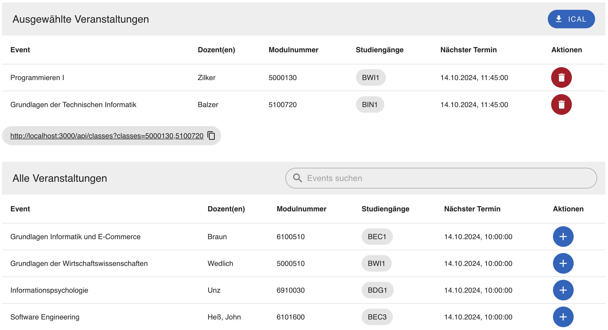
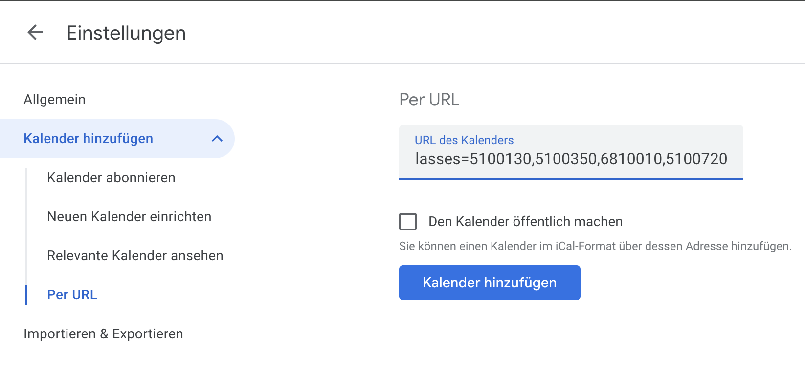
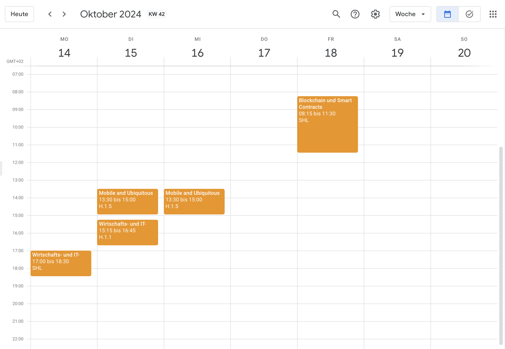
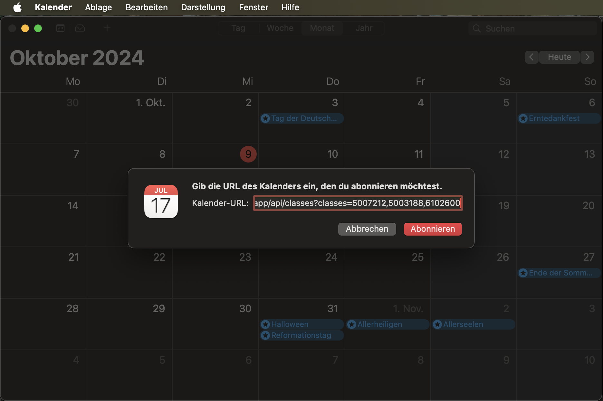
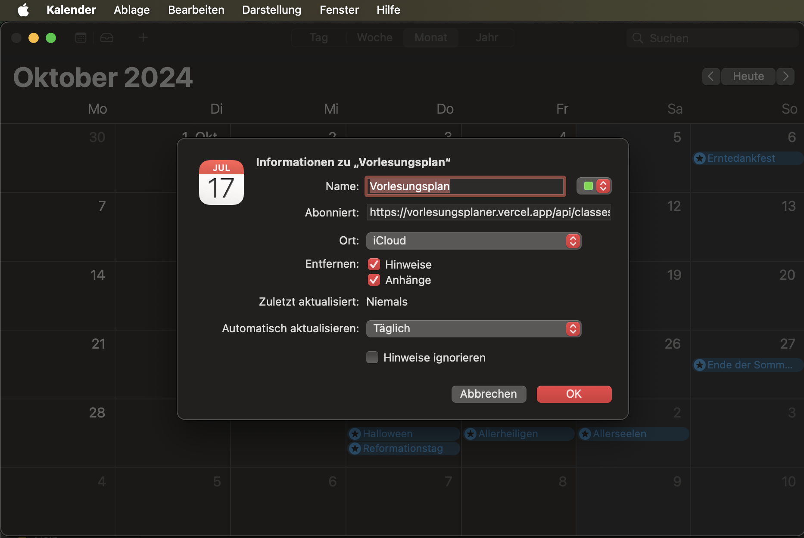

# Vorlesungsplaner

Deployed at [https://vorlesungsplaner.vercel.app/](https://vorlesungsplaner.vercel.app/)

This is an updated version of [Vorlesungsplaner](https://github.com/Sebb767/Vorlesungsplaner).

This small web application allows users to export selected lectures at FHWS in the iCal format. Additionally, it is possible to subscribe to the calendar URL in external calendars to stay informed about any changes to the lectures.

## Usage



### Google Calendar Integration




### Apple Calendar Integration

`Ablage` -> `Neues Kalenderabonnement...`




## Contributing

### Development

To set up the development environment:

```bash
pnpm install
pnpm dev
```

### Production

To build the project for production:

```bash
pnpm build
```

## FAQ

### How does it work?

The app is a simple frontend that fetches data from the FHWS API and converts it into an iCal file.

### Why is there a need for a server?

A server is required to set up an endpoint with the appropriate content type in the header for downloading the calendar file:

```
"Content-Type", "text/calendar;charset=UTF-8"
"Content-Disposition", "'attachment; filename="vorlesungsplan.ics"'
```
